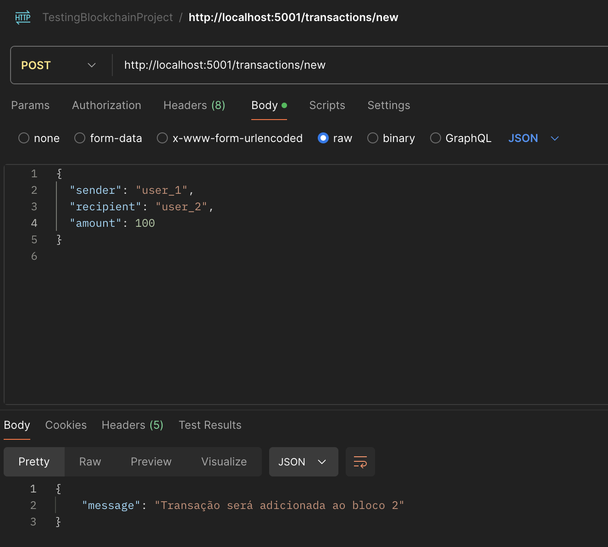
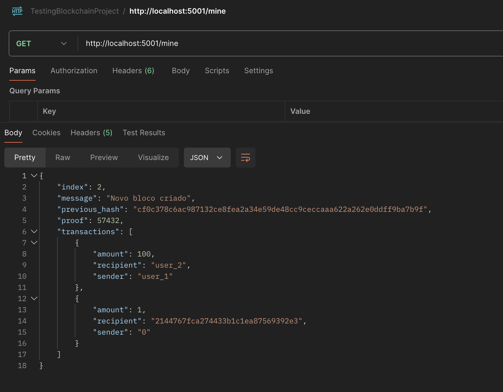
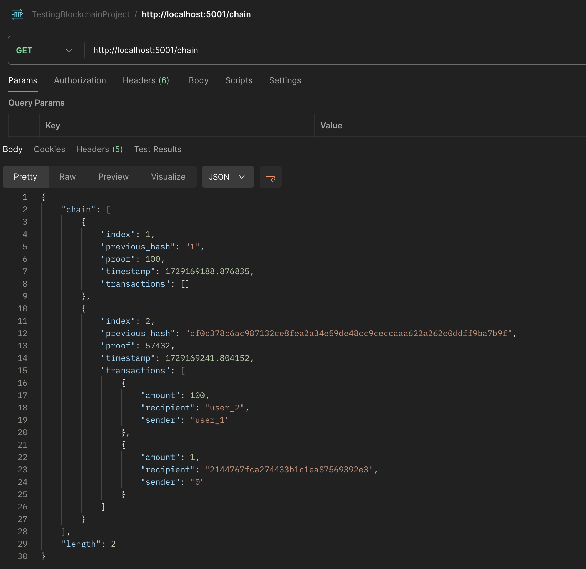

# SimpleBlockchain

## 🎯 Project Purpose

This project was developed with the intention of starting my learning journey in blockchain technology. Although it is a simple example, it covers the fundamental concepts such as transaction management, proof of work mining, and interaction with a basic API. The goal is to build a solid understanding of how blockchains work at their core, which will allow for future expansion and more advanced features.

---

## 📝 Features

- **Transaction Management:** Manage basic transactions within the blockchain.
- **Proof of Work Mining:** Includes a simplified proof of work algorithm for mining new blocks.
- **API Integration:** A basic API built with Flask for interacting with the blockchain.  
- **Postman Testing:** API tested and demonstrated using Postman to interact with the endpoints.

---

## 🚀 How It Works

1. **Start the Blockchain API:**  
   Run the Python script to launch the blockchain server. This will expose endpoints to interact with the blockchain and manage transactions.
   
2. **Interact with the Blockchain:**  
   Use Postman to test and interact with the following API endpoints:
   - Add new transactions
   - Mine blocks
   - View the current state of the blockchain

---

## API Interaction

Below is a screenshot of the app in action, showing the API response for blockchain data:

### 1. POST /transactions/new - Creating a New Transaction


### 2. GET /mine - Mining a New Block


### 3. GET /chain - Viewing the Blockchain


---

## Installation and Setup

1. Clone the repository:
```bash
git clone https://github.com/cmontilha/SimpleBlockchain.git
```
2. Install the required dependencies:
```bash
pip install Flask
```
3. Install requests:
```bash
pip install requests
```
4. Run the Flask application:
  ```bash
  python blockchain.py
  ```
---

## API Endpoints

- **`/transactions/new`** - Create a new transaction
- **`/mine`** - Mine a new block
- **`/chain`** - Return the current blockchain

---

## Technologies Used

- **Python**
- **Flask**
- **Blockchain Concepts**
- **Proof of Work Algorithm**

---

## 👨‍💻 Contribution

Feel free to contribute by opening issues or submitting pull requests. Any enhancements, optimizations, or bug fixes are welcome.

---
## 💡 Inspiration

This project was inspired by various tutorials and resources on blockchain technology, including:
- [Flask API for Beginners by Real Python](https://realpython.com/flask-connexion-rest-api/)
- [Official Flask Documentation (3.0.x)](https://flask.palletsprojects.com/en/3.0.x/) (for API integration and routing)
- [Building a Blockchain from Scratch with Python by Pythoneers on Medium](https://medium.com/pythoneers/building-a-blockchain-from-scratch-with-python-489e7116142e)
- [Build Your Own Blockchain in Python by Hackernoon](https://hackernoon.com/learn-blockchains-by-building-one-117428612f46)


  
These resources helped guide the implementation of core blockchain features like transaction management, proof of work mining, and creating a simple API.


